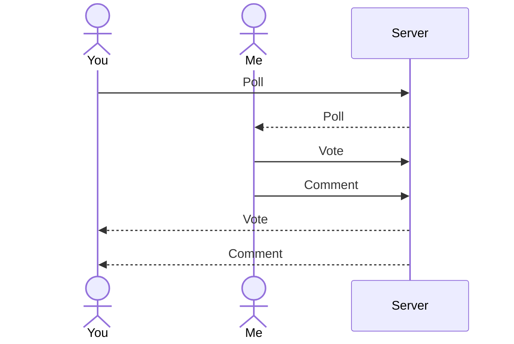

# WritersPoll

[My Notes](notes.md)

This application, in minimum viability, allows users to make polls which can be voted or commented on by the public. It is primarily targeted at fiction writers seeking quick feedback and community.

I saw something similar done for [baby names](https://www.babynamegenie.com/polls) and wondered if there was an author's version. From what I can tell, there isn't. This is a good opportunity to change that!

 [Markdown Documentation](https://docs.github.com/en/get-started/writing-on-github/getting-started-with-writing-and-formatting-on-github/basic-writing-and-formatting-syntax)

## 🚀 Specification Deliverable

[Example Startup](https://github.com/webprogramming260/startup-example/blob/main/README.md)

For this deliverable I did the following. I checked the box `[x]` and added a description for things I completed.

- [x] Proper use of Markdown
- [x] A concise and compelling elevator pitch
- [x] Description of key features
- [x] Description of how you will use each technology
- [x] One or more rough sketches of your application. Images must be embedded in this file using Markdown image references.

### Elevator pitch

Are you a writer who is waffling between two options? Are you not sure what to name a character or location and looking to get feedback? Writerspoll allows users to create and share polls to the public and recieve quick responses. Become part of a community of creatives and vote to help others out.

### Design
Here is a basic representation of the design. It will also include a login page and a poll creation page. 

Here is a sequence diagram that shows how users interact with the backend.

### Key features

- Option to login
- Page with all the polls and ability to choose one
- Ability to choose desired option in poll
- abiltiy to sumbit answer
- ability to change answer before pressing sumbit
- once submitted, see totals from all participants
- totals update in real time
- ability to comment
- able to see comments from other users, updated in real time
- ability to create a poll, which is posted to list of polls

### Technologies

I am going to use the required technologies in the following ways.

- **HTML** - Create the structure. I will need at least 2 pages. One for all the polls and a login page. I will possibly need another page for an induvidual poll. Use hyperlinks for poll choices.
- **CSS** - Use to style the website and polls in a clean format. Ensure the app works on different screen sizes.
- **React** - Used to display list of polls, poll results, comments under each poll, and login form. Allows users to interact with application including navigation to induvidual poll and clicking on desired choice. Provides a form for poll creation.
- **Service** - provides endpoints for the login, retrieving polls, submitting polls, submitting votes, retrieving vote status, submitting comments, retreiving comments, etc.
- **DB/Login** - stores users, polls, votes, comments. Registers and logs in users with secure passwords.
- **WebSocket** - When a user votes, comments, or creates a new poll, their action can be seen by all users.

## 🚀 AWS deliverable

For this deliverable I did the following. I checked the box `[x]` and added a description for things I completed.

- [x] **Server deployed and accessible with custom domain name** - [storypolls](https://storypolls.click).

## 🚀 HTML deliverable

For this deliverable I did the following. I checked the box `[x]` and added a description for things I completed.

- [ ] **HTML pages** - I did not complete this part of the deliverable.
- [ ] **Proper HTML element usage** - I did not complete this part of the deliverable.
- [ ] **Links** - I did not complete this part of the deliverable.
- [ ] **Text** - I did not complete this part of the deliverable.
- [ ] **3rd party API placeholder** - I did not complete this part of the deliverable.
- [ ] **Images** - I did not complete this part of the deliverable.
- [ ] **Login placeholder** - I did not complete this part of the deliverable.
- [ ] **DB data placeholder** - I did not complete this part of the deliverable.
- [ ] **WebSocket placeholder** - I did not complete this part of the deliverable.

## 🚀 CSS deliverable

For this deliverable I did the following. I checked the box `[x]` and added a description for things I completed.

- [ ] **Visually appealing colors and layout. No overflowing elements.** - I did not complete this part of the deliverable.
- [ ] **Use of a CSS framework** - I did not complete this part of the deliverable.
- [ ] **All visual elements styled using CSS** - I did not complete this part of the deliverable.
- [ ] **Responsive to window resizing using flexbox and/or grid display** - I did not complete this part of the deliverable.
- [ ] **Use of a imported font** - I did not complete this part of the deliverable.
- [ ] **Use of different types of selectors including element, class, ID, and pseudo selectors** - I did not complete this part of the deliverable.

## 🚀 React part 1: Routing deliverable

For this deliverable I did the following. I checked the box `[x]` and added a description for things I completed.

- [ ] **Bundled using Vite** - I did not complete this part of the deliverable.
- [ ] **Components** - I did not complete this part of the deliverable.
- [ ] **Router** - I did not complete this part of the deliverable.

## 🚀 React part 2: Reactivity deliverable

For this deliverable I did the following. I checked the box `[x]` and added a description for things I completed.

- [ ] **All functionality implemented or mocked out** - I did not complete this part of the deliverable.
- [ ] **Hooks** - I did not complete this part of the deliverable.

## 🚀 Service deliverable

For this deliverable I did the following. I checked the box `[x]` and added a description for things I completed.

- [ ] **Node.js/Express HTTP service** - I did not complete this part of the deliverable.
- [ ] **Static middleware for frontend** - I did not complete this part of the deliverable.
- [ ] **Calls to third party endpoints** - I did not complete this part of the deliverable.
- [ ] **Backend service endpoints** - I did not complete this part of the deliverable.
- [ ] **Frontend calls service endpoints** - I did not complete this part of the deliverable.
- [ ] **Supports registration, login, logout, and restricted endpoint** - I did not complete this part of the deliverable.

## 🚀 DB deliverable

For this deliverable I did the following. I checked the box `[x]` and added a description for things I completed.

- [ ] **Stores data in MongoDB** - I did not complete this part of the deliverable.
- [ ] **Stores credentials in MongoDB** - I did not complete this part of the deliverable.

## 🚀 WebSocket deliverable

For this deliverable I did the following. I checked the box `[x]` and added a description for things I completed.

- [ ] **Backend listens for WebSocket connection** - I did not complete this part of the deliverable.
- [ ] **Frontend makes WebSocket connection** - I did not complete this part of the deliverable.
- [ ] **Data sent over WebSocket connection** - I did not complete this part of the deliverable.
- [ ] **WebSocket data displayed** - I did not complete this part of the deliverable.
- [ ] **Application is fully functional** - I did not complete this part of the deliverable.
